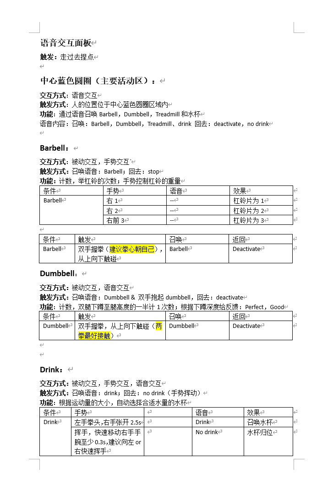
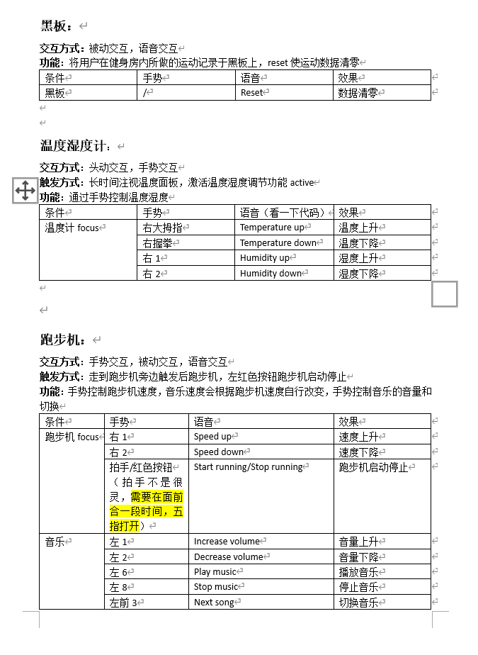

# HCI_GYM
开发者：熊天翼、孟本源、陈小雨、周朔亦

一个在Unity中开发的智能健身房场景，用户可以通过语音、手势和头动的方式和屋内的设备进行交互。项目可在Oculus Quest2设备上运行。

屋内设有跑步机、杠铃、哑铃三个可以交互的运动器材，温湿度控制系统，饮料自动分配系统和音乐系统，同时用户可以通过墙上的数据板观看今日的运动效果。

### 效果展示

[演示视频](doc/demo.mp4)见`doc/demo.mp4`, 也可在Bilibili上观看: https://www.bilibili.com/video/BV1444y177K9/ 

### 说明文档
交互方式的说明文档可见 [文档](doc/文档.docx), 建议参考 [项目总结](doc/HCI_GYM项目总结.pdf)。以下为`文档`的内容截图。

### 参考资料

https://github.com/FedorIvachev/OculusMRTKUnityProject.git

https://github.com/VRSimulator/NUIX-Studio-APP.git

### 致谢

感谢史元春、郁纯老师一学期的课程教学，感谢Fedor、李志鹏助教在项目完成过程中的指导与帮助。
